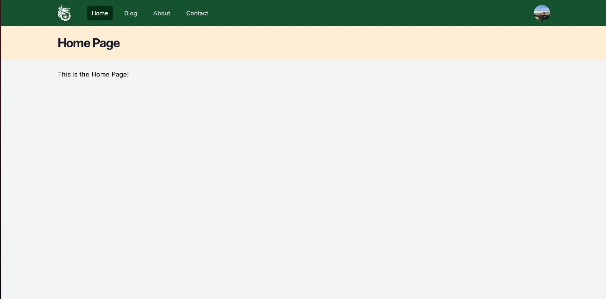

# LARAVEL PROJECT FOR PBKK
## 11 September 2024 Update
### Preparation
#### Laravel installation
The project uses laravel for its PHP web framework
#### Tailwind CSS Usage
To quickly styles and design the website, we use tailwindcss for the framework

### Blade Components
There are several modifications for the website to simplified the code, to make the component just simply run
```
php artisan make:component (name)
```
in the terminal. the additonal component are:
### Header Template
The provided code are <code>header.blade.php</code> the template for header in each page. 
```
<header class="bg-orange-100">
    <div class="mx-auto max-w-7xl px-4 py-6 sm:px-6 lg:px-8">
      <h1 class="text-3xl font-bold tracking-tight text-gray-900">{{ $slot }}</h1>
    </div>
</header>
```
all pages will get the same functionality easily by passing the argument that matches the page by using
```
<x-slot:title>{{$title}}</x-slot:title>
``` 
### NavBar Template
Using this template we can just passing the attributes in the <code>navbar.blade.php</code> to <code>navlink.blade.php</code> easily
```
<a
    class="{{ $active ? 'bg-green-950 text-white' : 'text-gray-300 hover:bg-orange-200 hover:text-white' }} 
    rounded-md px-3 py-2 text-sm font-medium"  
    aria-current="{{ $active ? 'page' : false }}"{{ $attributes }}>{{ $slot  }}
</a>
```
```
<x-navlink href="/" :active="request()->is('/')">Home< x-navlink>
<x-navlink href="/blog" :active="request()->is('blog')">Blog</x-navlink>
<x-navlink href="/about" :active="request()->is('about')">About</x-navlink>
<x-navlink href="/contact" :active="request()->is('contact')">Contact</x-navlink>
```
### Result
